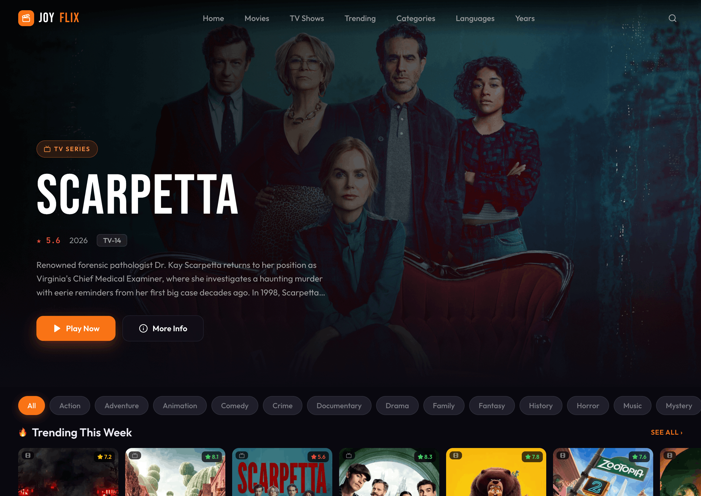

<div align="center">
  

  <br />
  <br />

  <h1>🍿 JoyFlix</h1>
  <p>
    <strong>A stunning, high-performance open-source streaming discovery platform.</strong>
  </p>
  
  <p>
    <a href="#features">Features</a> •
    <a href="#tech-stack">Tech Stack</a> •
    <a href="#getting-started">Getting Started</a> •
    <a href="#configuration">Configuration</a> •
    <a href="#contributing">Contributing</a>
  </p>
</div>

---

## 🌟 Introduction

JoyFlix is a premium, open-source movie and TV show discovery application built with modern web technologies. Designed with a sleek, glassmorphic UI and smooth micro-interactions, JoyFlix offers a cinematic browsing experience tailored for cinephiles. It leverages the TMDB API to deliver real-time data, trending media, and advanced multi-dimensional filtering.

## ✨ Features

- **Cinematic UI/UX:** A stunning, fully responsive design featuring dynamic gradients, glassmorphic panels, and polished animations.
- **Advanced Discovery:** Filter through a vast database of movies and TV shows by Categories, Languages, and Release Years simultaneously.
- **Smart Search:** Lightning-fast, debounced global search to instantly find your favorite titles.
- **Infinite Scrolling:** Seamlessly load more content as you scroll with intelligent Intersection Observer integration.
- **Unified State Management:** Highly optimized global UI states using Zustand for instant UI updates and seamless memory caching.
- **Strictly Typed Architecture:** Built with comprehensive internal TypeScript models for extreme reliability and developer ease.

## 🛠 Tech Stack

- **Framework:** [Next.js 15 (App Router)](https://nextjs.org/)
- **Language:** [TypeScript](https://www.typescriptlang.org/)
- **UI Library:** [React 19](https://react.dev/)
- **Styling:** [Tailwind CSS v4](https://tailwindcss.com/) & Vanilla CSS Modules
- **State Management:** [Zustand](https://github.com/pmndrs/zustand)
- **Icons:** [Lucide React](https://lucide.dev/)
- **Data Source:** [TMDB API](https://www.themoviedb.org/)

## 🚀 Getting Started

Follow these steps to set up the project locally on your machine.

### Prerequisites

You will need **Node.js 20+** and your preferred package manager (npm, pnpm, yarn, or bun) installed. You will also need a TMDB API key.

1. Get your free API key from [The Movie Database (TMDB)](https://www.themoviedb.org/settings/api).

### Installation

1. **Clone the repository:**
   ```bash
   git clone https://github.com/your-username/stream-it.git
   cd stream-it
   ```

2. **Install dependencies:**
   ```bash
   npm install
   # or yarn install
   # or bun install
   ```

3. **Set up Environment Variables:**
   - The application relies on a TMDB key located inside `app/lib/tmdb.js`.
   - Update the `TMDB_KEY` export inside that file with your own developer key, or optionally refactor it to use `.env.local`:
   ```env
   NEXT_PUBLIC_TMDB_KEY=your_tmdb_api_key_here
   ```

4. **Start the development server:**
   ```bash
   npm run dev
   # or yarn dev
   ```

5. **Open the App:**
   Navigate to [http://localhost:3000](http://localhost:3000) in your browser to see the application running.

## 📂 Project Structure

```text
├── app/
│   ├── categories/       # Category filtering pages
│   ├── components/       # Reusable UI elements (Cards, Nav, Discovery Grids)
│   ├── hooks/            # Custom React hooks (TMDB fetching, search)
│   ├── languages/        # Deep-dive language filtering pages
│   ├── lib/              # Core utilities and TMDB configurations
│   ├── movies/           # Dedicated movies hub
│   ├── store/            # Zustand global stores
│   ├── trending/         # Daily & Weekly trending hubs
│   ├── tv/               # Dedicated TV shows hub
│   └── years/            # Year-based filtering pages
├── public/               # Static assets & cover images
├── types/                # Global TypeScript definitions (index.d.ts)
└── README.md
```

## 🤝 Contributing

We love contributions! Whether you're fixing a bug, adding a new feature, or improving documentation, your help is appreciated.

1. Fork the Project
2. Create your Feature Branch (`git checkout -b feature/AmazingFeature`)
3. Commit your Changes (`git commit -m 'Add some AmazingFeature'`)
4. Push to the Branch (`git push origin feature/AmazingFeature`)
5. Open a Pull Request

## 📄 License

Distributed under the MIT License. See `LICENSE` for more information.

---

<div align="center">
  <sub>Built with ❤️ by the Open Source Community.</sub>
</div>
